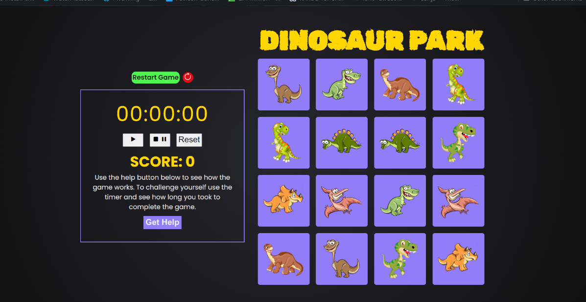

### index

# L2T12 Capstone Project 1 ReactJS Memory Game

> ReactJS Dinosaur Themed Memory Game.

---

### Table of Contents

- [Description](#description)
- [How To Use](#how-to-use)
- [References](#references)
- [Author Info](#author-info)

---

## Description

Simple reactjs dinosaur themed memory game created using the create react app command 8 differently styled components for the game, game cards, self timer, dialog box and score counter. The project uses react hooks to move state and props around, react router dom for navigation, mapping functions to render elements into JSX and more.

The aim game is to match cards with the same image as quick as possible with every restart the cards will reshuffle to keep the game interesting. Each complete match gives the user 2 points the game ends at 16 points. The self timer can be used to make the game more challenging so the user can compare how fast they took to complete the game. The self timer will pause when the dialog box is open and the user has full control of starting and restarting the timer.

#### Technologies

- Reactjs
- React hooks
- React Router Dom
- JSX
- CSS

[Back To The Top](#index)

---

## How To Use

#### Installation

- To install clone or download this repository
- Open the folder inside terminal or the command line of your choice
- run npm install
- npm start
- the project should start on http://localhost:3000/
- Website - [Live Demo](https://dinosaur-land.herokuapp.com/)

### Step 1

when the game loads the user gets a few seconds to see the cards facing up so they can memorize positions.

### Step 2

Once cards flip backwards hiding the image, the user can start matching cards as they remember. When the cards are a match the background will turn green like the example image below.

### Step 3

When the cards are not a match the background will turn red then flip backwards again hiding the image like the example image below.

### Step 4

When all cards have been matched, they will all have a green background like the example image below with an alert to congratulate the user and display an option to play again or quit the game.

### Step 5

Below image shows a closer look at the self timer including a "help" button that displays instructions of how to play the game when clicked.

### Step 6

Dialog box that displays when "help" button is clicked.

[Back To The Top](#index)

---

## References

- Website - [HyperionDev](https://www.hyperiondev.com/)

---

## Author Info

- Linkedin - [Gauta Ncholo](https://www.linkedin.com/in/gauta-ncholo/)

[Back To The Top](#index)

---
